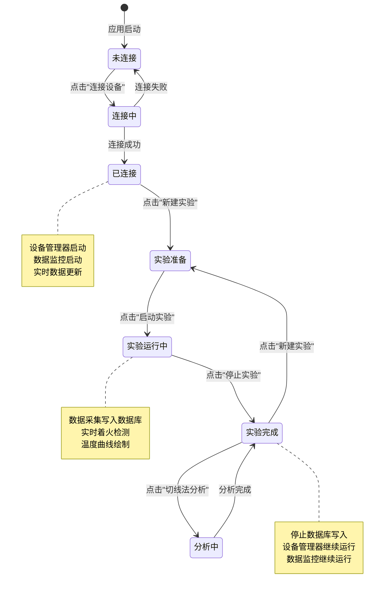
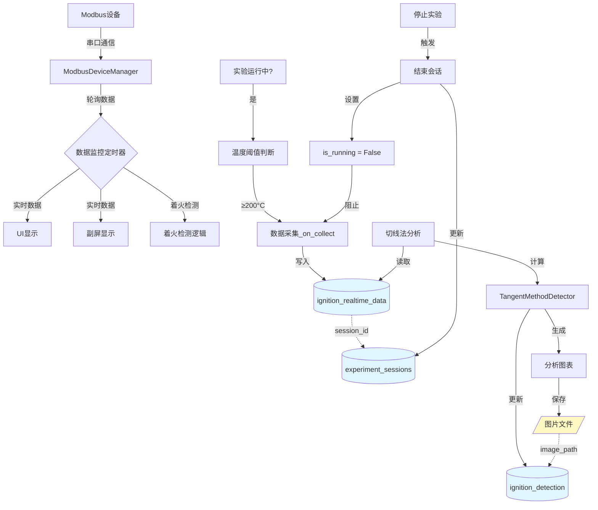
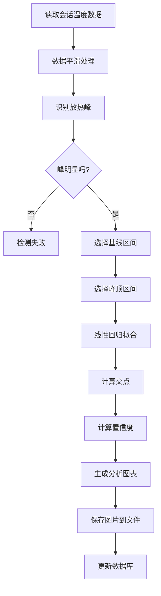

# 着火温度实验代码审查和工作流程文档

## 文档概述

本文档对着火温度实验系统的代码进行了全面审查，梳理了实验流程、数据存储过程和分析方法，并识别出需要改进的关键问题。

**文档版本**: 1.0  
**创建日期**: 2025-12-05  
**审查范围**:
- `src/controllers/ignition_controller.py` - 着火点实验控制器
- `src/views/pages/ignition_page.py` - 着火点实验UI界面
- `src/models/ignition_database.py` - 着火点实验数据库
- `src/views/dialogs/tangent_analysis_dialog.py` - 切线法分析对话框

---

## 1. 实验流程分析

### 1.1 实验状态机



### 1.2 实验流程详细步骤

#### 阶段1: 设备连接
1. **用户操作**: 点击"连接设备"按钮
2. **系统动作**:
   - 禁用连接按钮，显示"连接中..."
   - 在后台线程中创建 `ModbusDeviceManager`
   - 执行设备连接 (`manager.connect()`)
   - 启动设备管理器 (`manager.start()`) - 开始设备数据采集
   - 启动数据监控定时器 (`data_monitor_timer`) - 用于UI和副屏实时数据推送
3. **状态变化**: `未连接` → `已连接`
4. **按钮状态**: 
   - 连接设备: disabled
   - 新建实验: enabled
   - 启动实验: disabled
   - 停止实验: disabled

#### 阶段2: 创建实验会话
1. **用户操作**: 点击"新建实验"按钮
2. **系统动作**:
   - 生成实验编号: `IGN-YYYYMMDD-XXX`
   - 打开实验配置对话框
   - 用户填写实验信息（委托单位、操作员、样品名称等）
   - 创建数据库会话 (`db.start_experiment_session()`)
   - 保存会话ID到 `current_session_id`
3. **状态变化**: `已连接` → `实验准备`
4. **按钮状态**:
   - 连接设备: disabled
   - 新建实验: enabled
   - 启动实验: enabled
   - 停止实验: disabled

#### 阶段3: 启动实验
1. **用户操作**: 点击"启动实验"按钮
2. **系统动作**:
   - 更新会话状态为 'running'
   - 设置 `is_running = True`
   - 重置着火检测标志
   - 清空温度历史缓存
   - 启动UI更新定时器
   - 开始数据采集和数据库写入
3. **状态变化**: `实验准备` → `实验运行中`
4. **按钮状态**:
   - 连接设备: disabled
   - 新建实验: disabled
   - 启动实验: disabled
   - 停止实验: enabled

#### 阶段4: 实验运行
- **数据采集**: 每隔 `update_interval` (默认1000ms) 调用 `_on_collect()`
- **数据存储**: 满足温度阈值条件后写入数据库
- **实时显示**: 
  - 温度曲线绘制
  - 样品温度显示
  - 温控器参数显示
  - 实时着火检测
- **设备监控**: `data_monitor_timer` 持续轮询设备数据

#### 阶段5: 停止实验
1. **用户操作**: 点击"停止实验"按钮
2. **系统动作**:
   - 停止UI更新定时器
   - 设置 `is_running = False`
   - 结束数据库会话 (`db.end_experiment_session()`)
   - **注意**: 不停止设备管理器和数据监控定时器
3. **状态变化**: `实验运行中` → `实验完成`
4. **按钮状态**:
   - 连接设备: disabled
   - 新建实验: enabled
   - 启动实验: enabled
   - 停止实验: disabled

#### 阶段6: 切线法分析（手动触发）
1. **用户操作**: 点击"切线法分析"按钮
2. **系统动作**:
   - 从数据库读取当前会话的所有温度数据
   - 对6个样品分别执行切线法分析
   - 生成分析图表
   - 保存分析图片到文件系统
   - 更新分析结果到数据库
3. **结果展示**: 
   - 显示着火点温度
   - 显示置信度
   - 显示基线和峰顶拟合参数
   - 显示分析图表（温度曲线、基线、峰顶、交点）

---

## 2. 数据流向分析

### 2.1 数据流向图



### 2.2 数据采集条件

**当前实现** (存在不一致):
- `ignition_page.py` 中的 `_on_collect()` 方法检查温度阈值
- `ignition_controller.py` 中的 `collect_data()` 方法未检查温度阈值

**改进后的实现**:
- 统一在 `ignition_controller.py` 中检查温度阈值
- 阈值从 `experiment_config.yaml` 中读取 (`collect_start_temperature: 200.0`)
- 采集条件:
  1. `is_running == True` (实验运行中)
  2. `current_session_id is not None` (会话已创建)
  3. `pv >= collect_start_temperature` (达到采集起始温度)

---

## 3. 数据库结构分析

### 3.1 核心表结构

#### 3.1.1 实时温度数据表 (ignition_realtime_data)

**现有结构**:
```sql
CREATE TABLE IF NOT EXISTS ignition_realtime_data (
    id INTEGER PRIMARY KEY AUTOINCREMENT,
    timestamp DATETIME DEFAULT CURRENT_TIMESTAMP,
    pv REAL NOT NULL,
    ch1 REAL NOT NULL,
    ch2 REAL NOT NULL,
    ch3 REAL NOT NULL,
    ch4 REAL NOT NULL,
    ch5 REAL NOT NULL,
    ch6 REAL NOT NULL
);
```

**存在问题**: 
- ❌ 缺少 `session_id` 字段，无法关联到具体实验会话
- ❌ 无法区分哪些数据属于哪个实验
- ❌ 切线法分析时需要依赖时间范围查询，不够准确

**改进后的结构**:
```sql
CREATE TABLE IF NOT EXISTS ignition_realtime_data (
    id INTEGER PRIMARY KEY AUTOINCREMENT,
    session_id INTEGER,  -- 新增: 关联到实验会话
    timestamp DATETIME DEFAULT CURRENT_TIMESTAMP,
    pv REAL NOT NULL,
    ch1 REAL NOT NULL,
    ch2 REAL NOT NULL,
    ch3 REAL NOT NULL,
    ch4 REAL NOT NULL,
    ch5 REAL NOT NULL,
    ch6 REAL NOT NULL,
    FOREIGN KEY (session_id) REFERENCES experiment_sessions(id) ON DELETE CASCADE
);

-- 索引优化
CREATE INDEX IF NOT EXISTS idx_session_id ON ignition_realtime_data(session_id);
CREATE INDEX IF NOT EXISTS idx_timestamp ON ignition_realtime_data(timestamp);
```

#### 3.1.2 实验会话表 (experiment_sessions)

```sql
CREATE TABLE IF NOT EXISTS experiment_sessions (
    id INTEGER PRIMARY KEY AUTOINCREMENT,
    start_time DATETIME NOT NULL,
    end_time DATETIME,
    experiment_name TEXT,       -- 实验编号 (IGN-YYYYMMDD-XXX)
    sample_names TEXT,          -- 样品名称 (JSON字符串)
    client TEXT,                -- 委托单位
    operator TEXT,              -- 操作员
    description TEXT,           -- 实验描述
    status TEXT DEFAULT 'running'  -- prepared/running/completed/cancelled/error
);
```

#### 3.1.3 着火点检测结果表 (ignition_detection)

**现有结构**:
```sql
CREATE TABLE IF NOT EXISTS ignition_detection (
    id INTEGER PRIMARY KEY AUTOINCREMENT,
    session_id INTEGER,
    timestamp DATETIME DEFAULT CURRENT_TIMESTAMP,
    channel INTEGER NOT NULL,
    ignition_temperature REAL NOT NULL,
    detection_method TEXT DEFAULT 'realtime',
    tangent_temperature REAL,
    tangent_confidence REAL,
    baseline_k REAL,
    baseline_b REAL,
    peak_k REAL,
    peak_b REAL,
    FOREIGN KEY (session_id) REFERENCES experiment_sessions(id)
);
```

**存在问题**:
- ❌ 缺少 `tangent_analysis_image_path` 字段，无法存储分析图片路径
- ❌ 无法追溯切线法分析结果对应的图表

**改进后的结构**:
```sql
CREATE TABLE IF NOT EXISTS ignition_detection (
    id INTEGER PRIMARY KEY AUTOINCREMENT,
    session_id INTEGER,
    timestamp DATETIME DEFAULT CURRENT_TIMESTAMP,
    channel INTEGER NOT NULL,
    ignition_temperature REAL NOT NULL,
    detection_method TEXT DEFAULT 'realtime',
    tangent_temperature REAL,
    tangent_confidence REAL,
    baseline_k REAL,
    baseline_b REAL,
    peak_k REAL,
    peak_b REAL,
    tangent_analysis_image_path TEXT,  -- 新增: 切线法分析图片路径
    FOREIGN KEY (session_id) REFERENCES experiment_sessions(id)
);
```

### 3.2 数据库操作流程

#### 3.2.1 实验会话创建
```python
session_id = db.start_experiment_session(
    experiment_name="IGN-20251205-001",
    sample_names='["煤样1", "煤样2", "煤样3", "煤样4", "煤样5", "煤样6"]',
    client="某煤矿",
    operator="张三",
    description="标准煤样着火温度测试"
)
# 返回: session_id (例如: 42)
```

#### 3.2.2 实时数据写入
```python
# 改进前
record_id = db.insert_ignition_data(pv, ch1, ch2, ch3, ch4, ch5, ch6)

# 改进后
record_id = db.insert_ignition_data(
    pv, ch1, ch2, ch3, ch4, ch5, ch6,
    session_id=current_session_id  # 关联会话
)
```

#### 3.2.3 会话结束
```python
db.end_experiment_session(session_id, status='completed')
# 更新 end_time 和 status 字段
```

#### 3.2.4 切线法分析数据读取
```python
# 改进后的查询（基于session_id）
session_data = db.get_session_temperature_data(session_id)
# 返回:
# [
#   {
#     'timestamp': '2025-12-05 10:30:00.000',
#     'elapsed_seconds': 125.5,
#     'furnace_temperature': 250.5,
#     'sample1_temperature': 245.2,
#     ...
#   },
#   ...
# ]
```

#### 3.2.5 切线法结果存储
```python
# 改进后
db.update_tangent_method_result(
    session_id=session_id,
    channel=channel+1,
    tangent_temperature=result['ignition_temp'],
    confidence=result['confidence'],
    baseline_k=result['baseline_fit'][0],
    baseline_b=result['baseline_fit'][1],
    peak_k=result['peak_fit'][0],
    peak_b=result['peak_fit'][1],
    image_path=image_path  # 新增: 图片路径
)
```

---

## 4. 着火检测分析方法

### 4.1 实时检测方法

系统提供了3种实时检测方法，用于实验过程中的着火点判断：

#### 4.1.1 绝对温度法
- **原理**: 样品温度达到设定阈值即判定为着火
- **配置参数**: `absolute_temperature_threshold` (默认500°C)
- **适用场景**: 快速初步判断

#### 4.1.2 温升法
- **原理**: 样品温度相对炉温升高超过设定阈值
- **配置参数**: `temperature_rise_threshold` (默认50°C)
- **计算公式**: `ΔT = T_sample - T_furnace`
- **适用场景**: 检测放热反应

#### 4.1.3 升温速率法
- **原理**: 样品升温速率超过设定阈值
- **配置参数**: `rise_rate_threshold` (默认10°C/min)
- **计算公式**: `dT/dt = (T_current - T_previous) / Δt`
- **适用场景**: 检测剧烈放热

### 4.2 切线法分析（事后分析）

#### 4.2.1 理论依据
- **标准**: GB/T 18511-2017《煤的着火温度测定方法》
- **原理**: 在温度-时间曲线上，放热峰起点处基线切线与峰顶切线的交点对应的温度即为着火温度

#### 4.2.2 分析步骤


#### 4.2.3 关键参数
- **平滑窗口**: `smooth_window: 11` - Savitzky-Golay滤波窗口大小
- **基线区间**: 放热峰前的稳定区域
- **峰顶区间**: 放热峰上升最快的区域
- **置信度**: 基于拟合优度 (R²) 计算

#### 4.2.4 输出结果
- 着火点温度 (°C)
- 着火点时刻 (秒/分钟)
- 置信度 (0-1)
- 基线拟合参数 (k, b)
- 峰顶拟合参数 (k, b)
- 分析图表 (PNG格式)

---

## 5. 发现的主要问题

### 问题1: 数据库结构 - 缺少会话关联

**问题描述**:
- `ignition_realtime_data` 表缺少 `session_id` 字段
- 无法准确区分不同实验会话的数据
- 切线法分析依赖时间范围查询，可能不准确

**影响范围**:
- 数据查询和分析
- 报告生成
- 历史数据对比

**解决方案**:
1. 添加 `session_id INTEGER` 字段到 `ignition_realtime_data` 表
2. 添加外键约束: `FOREIGN KEY (session_id) REFERENCES experiment_sessions(id) ON DELETE CASCADE`
3. 修改 `insert_ignition_data()` 方法，增加 `session_id` 参数
4. 实现数据库迁移逻辑，处理旧数据库升级

### 问题2: 实验停止逻辑 - 设备管理器管理不当

**问题描述**:
- 代码注释和实现存在歧义
- 设备管理器和数据监控的生命周期不清晰

**当前实现** (正确):
```python
def stop_experiment(self):
    # ...
    self.is_running = False  # 停止数据写入
    # 注意：不停止设备管理器和数据监控
```

**澄清说明**:
- ✅ `stop_experiment()` **不**停止设备管理器
- ✅ `stop_experiment()` **不**停止数据监控定时器
- ✅ 设备继续采集数据，用于实时显示
- ✅ 只有 `is_running = False` 阻止数据写入数据库
- ✅ 设备管理器和数据监控只在 `cleanup()` 时停止

**解决方案**:
- 在 `stop_experiment()` 方法中添加详细注释说明设计意图
- 在控制器中添加注释说明生命周期管理

### 问题3: 切线法分析时机 - 自动触发不合理

**问题描述**:
- 当前实现：停止实验后自动弹出切线法分析对话框
- 用户可能需要先查看实验数据，再决定是否进行分析
- 分析结果未永久化存储，无法追溯

**当前实现**:
```python
def _on_stop(self):
    # ...
    if self.config['ignition_detection'].get('post_analysis', True):
        self._show_tangent_analysis_dialog()  # 自动弹出
```

**解决方案**:
1. 移除 `_on_stop()` 中的自动调用
2. 添加"切线法分析"按钮到控制面板
3. 按钮状态控制:
   - 实验停止后: enabled
   - 实验运行中: disabled
   - 需要有 `current_session_id`
4. 点击按钮时手动打开分析对话框
5. 分析结果永久化:
   - 保存分析图表为图片文件
   - 图片路径存入数据库
   - 便于报告生成和对比分析

### 问题4: 数据采集条件检查不一致

**问题描述**:
- `ignition_page.py` 中检查温度阈值
- `ignition_controller.py` 中未检查温度阈值
- 逻辑分散，不符合MVC架构

**当前实现**:
```python
# ignition_page.py (_on_collect)
collect_start_temp = self.config.get('collect_start_temperature', 200.0)
if pv < collect_start_temp:
    return

# ignition_controller.py (collect_data)
# 未检查温度阈值
```

**解决方案**:
1. 统一在 `ignition_controller.py` 的 `collect_data()` 中检查
2. 从配置文件读取阈值: `experiment_config.yaml` 中的 `collect_start_temperature`
3. 采集条件检查顺序:
   ```python
   def collect_data(self):
       # 1. 检查实验状态
       if not self.is_running or self.current_session_id is None:
           return False
       
       # 2. 读取温度数据
       pv = controller_data.get('pv', 0.0)
       
       # 3. 检查温度阈值
       collect_start_temp = self.config.get('collect_start_temperature', 200.0)
       if pv < collect_start_temp:
           return False
       
       # 4. 写入数据库（带session_id）
       record_id = self.db.insert_ignition_data(..., session_id=self.current_session_id)
   ```

### 问题5: 线程安全问题隐患

**问题描述**:
- `_execute_connect()` 在后台线程执行
- 发射 `device_connected` 信号可能从后台线程发出
- 信号槽函数 `_on_controller_device_connected()` 中直接更新UI

**潜在风险**:
- Qt UI 只能在主线程更新
- 从后台线程更新UI可能导致崩溃或未定义行为

**当前实现**:
```python
def _execute_connect(self):  # 后台线程
    # ...
    self.device_connected.emit(True, "设备连接成功")  # 从后台线程发射

def _on_controller_device_connected(self, success, message):
    # 直接更新UI（可能在后台线程执行）
    self.btn_connect.setText("连接设备")
    self.lbl_status.setText("状态: 已连接")
```

**解决方案**:
1. **方案A** (推荐): 使用 Qt 的信号-槽机制的 `Qt.QueuedConnection`
   ```python
   self.controller.device_connected.connect(
       self._on_controller_device_connected,
       Qt.QueuedConnection  # 确保槽函数在主线程执行
   )
   ```

2. **方案B**: 在槽函数中使用 `QMetaObject.invokeMethod()`
   ```python
   def _on_controller_device_connected(self, success, message):
       QMetaObject.invokeMethod(
           self,
           "_update_connection_ui",
           Qt.QueuedConnection,
           Q_ARG(bool, success),
           Q_ARG(str, message)
       )
   ```

3. **方案C**: 验证信号是否已经是线程安全的
   - 如果 `IgnitionController` 是 `QObject` 且信号从 `QTimer` 或其他 Qt 对象发出
   - 则信号-槽连接默认是队列连接，已经是线程安全的

---

## 6. 改进实施计划

### 6.1 数据库修改

#### 6.1.1 修改 `ignition_realtime_data` 表结构
```python
def _check_and_upgrade_realtime_data_table(self):
    """检查并升级 ignition_realtime_data 表"""
    cursor = self.conn.execute("PRAGMA table_info(ignition_realtime_data)")
    columns = [col[1] for col in cursor.fetchall()]
    
    if 'session_id' not in columns:
        self.logger.warning("⚠ 检测到旧表结构，需要升级...")
        
        # 备份旧表
        self.cursor.execute("""
            CREATE TABLE ignition_realtime_data_backup AS 
            SELECT * FROM ignition_realtime_data
        """)
        
        # 删除旧表
        self.cursor.execute("DROP TABLE ignition_realtime_data")
        
        # 创建新表（带session_id）
        self.cursor.execute("""
            CREATE TABLE IF NOT EXISTS ignition_realtime_data (
                id INTEGER PRIMARY KEY AUTOINCREMENT,
                session_id INTEGER,
                timestamp DATETIME DEFAULT CURRENT_TIMESTAMP,
                pv REAL NOT NULL,
                ch1 REAL NOT NULL,
                ch2 REAL NOT NULL,
                ch3 REAL NOT NULL,
                ch4 REAL NOT NULL,
                ch5 REAL NOT NULL,
                ch6 REAL NOT NULL,
                FOREIGN KEY (session_id) REFERENCES experiment_sessions(id) ON DELETE CASCADE
            )
        """)
        
        # 创建索引
        self.cursor.execute("""
            CREATE INDEX IF NOT EXISTS idx_session_id 
            ON ignition_realtime_data(session_id)
        """)
        
        # 恢复数据（session_id=NULL）
        self.cursor.execute("""
            INSERT INTO ignition_realtime_data 
            (id, session_id, timestamp, pv, ch1, ch2, ch3, ch4, ch5, ch6)
            SELECT id, NULL, timestamp, pv, ch1, ch2, ch3, ch4, ch5, ch6
            FROM ignition_realtime_data_backup
        """)
        
        # 删除备份表
        self.cursor.execute("DROP TABLE ignition_realtime_data_backup")
        
        self.conn.commit()
        self.logger.info("✓ 表结构升级完成")
```

#### 6.1.2 修改 `ignition_detection` 表结构
```python
def _check_and_upgrade_ignition_detection_table(self):
    """检查并升级 ignition_detection 表"""
    cursor = self.conn.execute("PRAGMA table_info(ignition_detection)")
    columns = [col[1] for col in cursor.fetchall()]
    
    if 'tangent_analysis_image_path' not in columns:
        self.cursor.execute("""
            ALTER TABLE ignition_detection 
            ADD COLUMN tangent_analysis_image_path TEXT
        """)
        self.conn.commit()
        self.logger.info("✓ ignition_detection 表已添加 tangent_analysis_image_path 字段")
```

#### 6.1.3 更新数据插入方法
```python
def insert_ignition_data(self, pv: float, ch1: float, ch2: float, 
                        ch3: float, ch4: float, ch5: float, ch6: float,
                        session_id: int = None) -> int:
    """
    插入一条实时温度数据
    
    Args:
        pv: 炉膛温度
        ch1-ch6: 样品1-6的温度
        session_id: 实验会话ID（可选，兼容旧代码）
        
    Returns:
        插入数据的ID
    """
    try:
        self.cursor.execute("""
            INSERT INTO ignition_realtime_data 
            (session_id, pv, ch1, ch2, ch3, ch4, ch5, ch6)
            VALUES (?, ?, ?, ?, ?, ?, ?, ?)
        """, (session_id, pv, ch1, ch2, ch3, ch4, ch5, ch6))
        
        self.conn.commit()
        return self.cursor.lastrowid
    except sqlite3.Error as e:
        self.logger.error(f"✗ 插入数据失败: {e}")
        self.conn.rollback()
        return -1
```

#### 6.1.4 更新切线法结果存储方法
```python
def update_tangent_method_result(self, session_id: int, channel: int,
                                tangent_temperature: float, confidence: float,
                                baseline_k: float, baseline_b: float,
                                peak_k: float, peak_b: float,
                                image_path: str = None) -> bool:
    """
    更新切线法检测结果
    
    Args:
        session_id: 实验会话ID
        channel: 通道号(1-6)
        tangent_temperature: 切线法检测的着火温度
        confidence: 置信度 (0-1)
        baseline_k: 基线斜率
        baseline_b: 基线截距
        peak_k: 峰顶斜率
        peak_b: 峰顶截距
        image_path: 分析图片路径（新增）
        
    Returns:
        是否更新成功
    """
    try:
        self.cursor.execute("""
            UPDATE ignition_detection 
            SET tangent_temperature = ?,
                tangent_confidence = ?,
                baseline_k = ?,
                baseline_b = ?,
                peak_k = ?,
                peak_b = ?,
                tangent_analysis_image_path = ?
            WHERE session_id = ? AND channel = ?
        """, (tangent_temperature, confidence, baseline_k, baseline_b,
              peak_k, peak_b, image_path, session_id, channel))
        
        self.conn.commit()
        
        if self.cursor.rowcount > 0:
            self.logger.info(
                f"✓ 切线法结果已更新: 通道{channel}, "
                f"温度{tangent_temperature:.1f}°C, 置信度{confidence:.2f}"
            )
            return True
        else:
            self.logger.warning(f"⚠ 未找到对应的检测记录: session_id={session_id}, channel={channel}")
            return False
            
    except sqlite3.Error as e:
        self.logger.error(f"✗ 更新切线法结果失败: {e}")
        self.conn.rollback()
        return False
```

### 6.2 控制器修改

#### 6.2.1 优化 `collect_data()` 方法
```python
def collect_data(self):
    """
    采集并保存实验数据
    
    数据采集条件:
    1. 实验必须处于运行状态 (is_running == True)
    2. 实验会话必须存在 (current_session_id is not None)
    3. 炉温必须达到采集起始温度 (pv >= collect_start_temperature)
    
    Returns:
        bool: 采集是否成功
    """
    # 条件1: 检查实验状态和会话
    if not self.manager or not self.is_running or self.current_session_id is None:
        return False
    
    try:
        # 读取温度数据
        controller_data = self.manager.get_latest_data('着火点-温控仪表')
        temp_module_data = self.manager.get_latest_data('着火点-温度模块')
        
        if not controller_data or not temp_module_data:
            return False
        
        pv = controller_data.get('pv', 0.0)
        
        # 条件2: 检查温度阈值
        collect_start_temp = self.config.get('collect_start_temperature', 200.0)
        if pv < collect_start_temp:
            return False  # 温度未达到，不采集
        
        channels = temp_module_data.get('channels', [])
        
        if len(channels) < 6:
            self.log_message.emit("✗ 温度通道数据不完整")
            return False
        
        # 提取通道温度
        ch1 = channels[0].get('temperature', 0.0)
        ch2 = channels[1].get('temperature', 0.0)
        ch3 = channels[2].get('temperature', 0.0)
        ch4 = channels[3].get('temperature', 0.0)
        ch5 = channels[4].get('temperature', 0.0)
        ch6 = channels[5].get('temperature', 0.0)
        
        # 写入数据库（关联会话ID）
        record_id = self.db.insert_ignition_data(
            pv, ch1, ch2, ch3, ch4, ch5, ch6,
            session_id=self.current_session_id  # 关联会话
        )
        
        if record_id > 0:
            self.logger.debug(f"数据已写入数据库 (ID: {record_id}, Session: {self.current_session_id})")
            return True
        else:
            self.log_message.emit("✗ 数据写入失败")
            return False
            
    except Exception as e:
        self.log_message.emit(f"✗ 采集数据失败: {e}")
        self.logger.error(f"采集数据失败: {e}")
        return False
```

#### 6.2.2 澄清 `stop_experiment()` 逻辑
```python
def stop_experiment(self):
    """
    停止实验
    
    设计说明:
    - 停止实验时，只更新实验状态 (is_running = False)
    - 不停止设备管理器 (manager.stop())
    - 不停止数据监控定时器 (data_monitor_timer.stop())
    
    原因:
    - 设备仍然连接，用户可能需要继续查看实时数据
    - 副屏实时显示需要持续更新
    - 只有在断开设备连接或系统清理时才停止设备管理器和数据监控
    
    数据写入控制:
    - collect_data() 方法会检查 is_running 标志
    - is_running = False 后，collect_data() 会提前返回，不再写入数据库
    - 从而实现"停止数据写入"但"保持实时显示"的效果
    
    Returns:
        bool: 停止是否成功
    """
    if not self.is_running:
        return False
    
    try:
        self.log_message.emit("停止实验...")
        
        # 结束数据库会话
        if self.current_session_id is not None:
            self.db.end_experiment_session(self.current_session_id, status='completed')
            self.log_message.emit(f"✓ 实验会话已结束 (ID: {self.current_session_id})")
        
        # 更新状态（关键：阻止数据写入）
        self.is_running = False
        self._update_state("idle")
        self.experiment_stopped.emit()
        
        # 注意：设备管理器和数据监控定时器继续运行
        # 它们将在 cleanup() 方法中停止
        
        exp_id = self.current_experiment_config.get('experiment_id', '未知') if self.current_experiment_config else '未知'
        self.status_updated.emit(f"状态: 已停止 ({exp_id})")
        self.log_message.emit("✓ 实验已停止")
        self.logger.info(f"实验已停止: {exp_id}")
        
        return True
    
    except Exception as e:
        self.log_message.emit(f"✗ 停止失败: {e}")
        self.logger.error(f"停止实验失败: {e}")
        return False
```

### 6.3 UI页面修改

#### 6.3.1 简化 `_on_collect()` 方法
```python
def _on_collect(self):
    """
    采集数据（通过控制器）
    
    注意: 
    - 温度阈值判断已移至 controller.collect_data() 中
    - 此方法仅负责调用控制器方法
    """
    if not self.is_running:
        return
    
    # 调用控制器采集数据（控制器内部会检查温度阈值和会话ID）
    success = self.controller.collect_data()
    
    if success:
        # 只在第一次采集成功时记录日志
        if not hasattr(self, '_collect_logged'):
            collect_start_temp = self.config.get('collect_start_temperature', 200.0)
            self._thread_safe_log(f"✓ 数据采集已启用（起始温度: {collect_start_temp}°C）")
            self._collect_logged = True
```

#### 6.3.2 添加切线法分析按钮
```python
def _create_control_panel(self):
    """创建控制面板"""
    group = QGroupBox("实验控制")
    layout = QGridLayout(group)
    
    # 第1行第1列：连接按钮
    self.btn_connect = QPushButton("连接设备")
    self.btn_connect.setObjectName("primaryButton")
    self.btn_connect.clicked.connect(self._on_connect)
    layout.addWidget(self.btn_connect, 0, 0)
    
    # 第1行第2列：新建实验按钮
    self.btn_new_experiment = QPushButton("新建实验")
    self.btn_new_experiment.setObjectName("primaryButton")
    self.btn_new_experiment.clicked.connect(self._on_new_experiment)
    self.btn_new_experiment.setEnabled(False)
    layout.addWidget(self.btn_new_experiment, 0, 1)
    
    # 第2行第1列：启动按钮
    self.btn_start = QPushButton("启动实验")
    self.btn_start.setObjectName("successButton")
    self.btn_start.clicked.connect(self._on_start)
    self.btn_start.setEnabled(False)
    layout.addWidget(self.btn_start, 1, 0)
    
    # 第2行第2列：停止按钮
    self.btn_stop = QPushButton("停止实验")
    self.btn_stop.setObjectName("dangerButton")
    self.btn_stop.clicked.connect(self._on_stop)
    self.btn_stop.setEnabled(False)
    layout.addWidget(self.btn_stop, 1, 1)
    
    # 第3行第1列：切线法分析按钮（新增）
    self.btn_tangent_analysis = QPushButton("切线法分析")
    self.btn_tangent_analysis.setObjectName("infoButton")
    self.btn_tangent_analysis.clicked.connect(self._on_tangent_analysis)
    self.btn_tangent_analysis.setEnabled(False)
    self.btn_tangent_analysis.setToolTip("实验停止后可进行切线法着火点分析")
    layout.addWidget(self.btn_tangent_analysis, 2, 0, 1, 2)  # 跨2列
    
    # 第4行：状态标签（跨2列）
    self.lbl_status = QLabel("状态: 未连接")
    self.lbl_status.setStyleSheet("font-weight: bold; font-size: 12pt;")
    layout.addWidget(self.lbl_status, 3, 0, 1, 2)
    
    # 第5行：检测标准标签（跨2列）
    lbl_standard = QLabel("检测标准: GB/T 18511-2017《煤的着火温度测定方法》")
    lbl_standard.setStyleSheet("font-size: 9pt; color: #666666; padding: 5px 0px;")
    lbl_standard.setWordWrap(True)
    layout.addWidget(lbl_standard, 4, 0, 1, 2)
    
    return group
```

#### 6.3.3 移除自动切线法分析
```python
def _on_stop(self):
    """停止按钮点击（通过控制器）"""
    if not self.is_running:
        return
    
    # 停止定时器
    self.update_timer.stop()
    
    # 使用控制器停止
    self.controller.stop_experiment()
    
    # 移除自动切线法分析
    # if self.config['ignition_detection'].get('post_analysis', True):
    #     self._show_tangent_analysis_dialog()
```

#### 6.3.4 实现手动切线法分析
```python
def _on_tangent_analysis(self):
    """切线法分析按钮点击"""
    if self.current_session_id is None:
        QMessageBox.warning(self, "提示", "没有可用的实验数据")
        return
    
    # 打开切线法分析对话框
    self._show_tangent_analysis_dialog()

def _show_tangent_analysis_dialog(self):
    """显示切线法分析对话框"""
    try:
        dialog = TangentAnalysisDialog(
            session_id=self.current_session_id,
            db=self.db,
            config=self.config,
            parent=self
        )
        dialog.exec()
    except Exception as e:
        self._thread_safe_log(f"✗ 切线法分析失败: {e}")
        QMessageBox.critical(self, "错误", f"切线法分析失败: {e}")
```

#### 6.3.5 更新按钮状态控制
```python
def _thread_safe_update_buttons(self, connect_enabled, new_exp_enabled, 
                                start_enabled, stop_enabled, 
                                tangent_analysis_enabled=False):
    """线程安全地更新按钮状态"""
    self.btn_connect.setEnabled(connect_enabled)
    self.btn_new_experiment.setEnabled(new_exp_enabled)
    self.btn_start.setEnabled(start_enabled)
    self.btn_stop.setEnabled(stop_enabled)
    self.btn_tangent_analysis.setEnabled(tangent_analysis_enabled)

def _on_controller_experiment_stopped(self):
    """处理控制器的实验停止事件"""
    # 更新本地状态（兼容性）
    self.is_running = False
    
    # 状态5: 实验完成/停止 - 可以进行切线法分析
    exp_id = self.current_experiment_config.get('experiment_id', '未知') if self.current_experiment_config else '未知'
    self._thread_safe_update_status(
        f"状态: 已停止 ({exp_id})",
        "font-weight: bold; font-size: 12pt; color: #999999;"
    )
    self._thread_safe_update_buttons(
        connect_enabled=False,
        new_exp_enabled=True,
        start_enabled=True,
        stop_enabled=False,
        tangent_analysis_enabled=True  # 停止后可以分析
    )
```

#### 6.3.6 修复线程安全问题
```python
def _connect_controller_signals(self):
    """连接控制器信号（使用队列连接确保线程安全）"""
    if not self.controller:
        return
    
    # 使用队列连接确保槽函数在主线程执行
    self.controller.device_connected.connect(
        self._on_controller_device_connected,
        Qt.QueuedConnection
    )
    self.controller.experiment_created.connect(
        self._on_controller_experiment_created,
        Qt.QueuedConnection
    )
    self.controller.experiment_started.connect(
        self._on_controller_experiment_started,
        Qt.QueuedConnection
    )
    self.controller.experiment_stopped.connect(
        self._on_controller_experiment_stopped,
        Qt.QueuedConnection
    )
    self.controller.log_message.connect(
        self._thread_safe_log,
        Qt.QueuedConnection
    )
```

### 6.4 切线法对话框修改

#### 6.4.1 添加图片保存功能
```python
def _create_sample_widget(self, channel):
    """创建单个样品的显示组件"""
    widget = QWidget()
    layout = QVBoxLayout(widget)
    
    # ... 现有代码 ...
    
    # 添加"保存图片"按钮
    btn_save_image = QPushButton(f"保存样品{channel+1}分析图")
    btn_save_image.setObjectName("standardButton")
    btn_save_image.clicked.connect(lambda: self._save_analysis_image(channel))
    layout.addWidget(btn_save_image)
    
    return widget

def _save_analysis_image(self, channel):
    """保存单个样品的分析图"""
    result = self.analysis_results.get(channel)
    if result is None:
        QMessageBox.warning(self, "提示", f"样品{channel+1}没有有效的分析结果")
        return
    
    try:
        # 获取实验信息
        session_info = self.db.get_all_experiment_sessions()[0]  # 假设获取当前会话
        experiment_id = session_info.get('experiment_name', f'session_{self.session_id}')
        
        # 创建保存目录
        from utils.path_manager import PathManager
        image_dir = PathManager.get_data_path(f"analysis_images/{experiment_id}")
        os.makedirs(image_dir, exist_ok=True)
        
        # 生成文件名
        image_filename = f"tangent_ch{channel+1}.png"
        image_path = os.path.join(image_dir, image_filename)
        
        # 保存图片
        plot_widget = self.sample_widgets[channel].findChild(pg.PlotWidget, f"plot_widget_{channel}")
        exporter = pg.exporters.ImageExporter(plot_widget.plotItem)
        exporter.parameters()['width'] = 1200  # 设置宽度
        exporter.export(image_path)
        
        # 更新数据库
        self.db.update_tangent_method_result(
            session_id=self.session_id,
            channel=channel+1,
            tangent_temperature=result['ignition_temp'],
            confidence=result['confidence'],
            baseline_k=result['baseline_fit'][0],
            baseline_b=result['baseline_fit'][1],
            peak_k=result['peak_fit'][0],
            peak_b=result['peak_fit'][1],
            image_path=image_path  # 保存图片路径
        )
        
        self._log(f"✓ 样品{channel+1}分析图已保存: {image_path}")
        QMessageBox.information(self, "成功", f"分析图已保存至:\n{image_path}")
        
    except Exception as e:
        self._log(f"✗ 保存图片失败: {e}")
        QMessageBox.critical(self, "错误", f"保存图片失败: {e}")
```

#### 6.4.2 添加批量保存功能
```python
def _init_ui(self):
    """初始化界面"""
    layout = QVBoxLayout(self)
    
    # ... 现有代码 ...
    
    # 按钮区域
    button_layout = QHBoxLayout()
    button_layout.addStretch()
    
    # 新增: 批量保存按钮
    self.btn_save_all = QPushButton("保存所有分析结果")
    self.btn_save_all.setStyleSheet("""
        QPushButton {
            background-color: #4caf50;
            color: white;
            padding: 10px 20px;
            border: none;
            border-radius: 5px;
            font-weight: bold;
        }
        QPushButton:hover {
            background-color: #45a049;
        }
    """)
    self.btn_save_all.clicked.connect(self._save_all_analysis_results)
    button_layout.addWidget(self.btn_save_all)
    
    self.btn_export = QPushButton("导出报告")
    # ... 现有代码 ...
    
    layout.addLayout(button_layout)

def _save_all_analysis_results(self):
    """批量保存所有样品的分析结果"""
    if not self.analysis_results:
        QMessageBox.warning(self, "提示", "没有可保存的分析结果")
        return
    
    saved_count = 0
    for channel in range(6):
        if channel in self.analysis_results:
            try:
                self._save_analysis_image(channel)
                saved_count += 1
            except Exception as e:
                self._log(f"✗ 保存样品{channel+1}失败: {e}")
    
    QMessageBox.information(self, "完成", f"已成功保存 {saved_count} 个样品的分析结果")
```

---

## 7. 配置文件说明

### 7.1 experiment_config.yaml 关键配置

```yaml
ignition_experiment:
  # 数据采集起始温度（默认200°C）
  collect_start_temperature: 200.0
  
  # 着火检测配置
  ignition_detection:
    # 是否启用实时检测
    realtime_detection: true
    
    # 绝对温度法
    absolute_temperature_threshold: 500.0  # °C
    
    # 温升法
    temperature_rise_threshold: 50.0  # °C
    temperature_rise_enabled: true
    
    # 升温速率法
    rise_rate_threshold: 10.0  # °C/min
    rise_rate_enabled: true
    
    # 切线法配置
    tangent_method:
      smooth_window: 11  # Savitzky-Golay滤波窗口
      baseline_length: 50  # 基线区间长度（数据点数）
      peak_length: 30  # 峰顶区间长度（数据点数）
      min_peak_prominence: 10.0  # 最小峰突出度
    
    # 是否停止实验后自动分析（已废弃，现在改为手动触发）
    post_analysis: false  # 设为false，不再自动分析
```

---

## 8. 测试计划

### 8.1 数据库迁移测试
- [ ] 使用旧数据库文件（无session_id字段）测试升级
- [ ] 验证新字段和外键约束创建成功
- [ ] 验证索引创建成功
- [ ] 验证旧数据能够正常访问（session_id=NULL）

### 8.2 数据采集测试
- [ ] 启动实验，验证低于200°C时不写入数据
- [ ] 验证达到200°C后开始写入数据
- [ ] 验证每条数据的session_id正确关联
- [ ] 验证停止实验后不再写入数据

### 8.3 实验停止测试
- [ ] 停止实验后验证不再写入数据库
- [ ] 验证设备管理器仍在运行（日志有输出）
- [ ] 验证UI数据继续更新（温度显示、曲线绘制）
- [ ] 验证副屏实时数据继续推送

### 8.4 切线法分析测试
- [ ] 实验停止后，验证"切线法分析"按钮变为可用
- [ ] 点击按钮，验证对话框正常打开
- [ ] 验证能够读取当前会话的数据
- [ ] 验证6个样品的分析结果正确显示
- [ ] 验证图片保存功能
- [ ] 验证数据库更新（image_path字段）
- [ ] 验证批量保存功能

### 8.5 线程安全测试
- [ ] 多次连接/断开设备，观察UI是否异常
- [ ] 在连接过程中快速点击其他按钮，观察程序是否崩溃
- [ ] 检查日志是否有线程相关的警告或错误

### 8.6 集成测试
- [ ] 完整实验流程：连接设备 → 新建实验 → 启动实验 → 运行5分钟 → 停止实验 → 切线法分析 → 保存结果
- [ ] 多次实验循环：停止 → 新建 → 启动 → 停止 → 分析
- [ ] 断开设备后重新连接，验证状态恢复正常

---

## 9. 附录

### 9.1 实验状态转换表

| 当前状态 | 触发事件 | 下一状态 | 按钮状态 | 备注 |
|---------|---------|---------|---------|------|
| 未连接 | 点击"连接设备" | 连接中 | 连接:disabled, 其他:disabled | - |
| 连接中 | 连接成功 | 已连接 | 连接:disabled, 新建:enabled | 启动设备管理器和数据监控 |
| 连接中 | 连接失败 | 未连接 | 连接:enabled, 其他:disabled | 显示错误提示 |
| 已连接 | 点击"新建实验" | 实验准备 | 连接:disabled, 新建:enabled, 启动:enabled | 创建数据库会话 |
| 实验准备 | 点击"启动实验" | 实验运行中 | 新建:disabled, 停止:enabled | 开始数据采集 |
| 实验运行中 | 点击"停止实验" | 实验完成 | 新建:enabled, 启动:enabled, 切线法:enabled | 停止数据写入，但保持实时显示 |
| 实验完成 | 点击"新建实验" | 实验准备 | 切线法:disabled | 创建新会话 |
| 实验完成 | 点击"切线法分析" | 分析中 | - | 打开分析对话框 |

### 9.2 关键方法调用链

#### 连接设备
```
_on_connect()
  └─> controller.connect_devices()
        └─> _execute_connect() [后台线程]
              ├─> ModbusDeviceManager.connect()
              ├─> manager.start()
              ├─> start_data_monitoring()
              └─> device_connected.emit(True, msg)
                    └─> _on_controller_device_connected()
                          └─> 更新UI状态
```

#### 启动实验
```
_on_start()
  └─> controller.start_experiment()
        ├─> db.update_session(status='running')
        ├─> is_running = True
        └─> experiment_started.emit()
              └─> _on_controller_experiment_started()
                    └─> 更新UI状态，启动定时器
```

#### 数据采集
```
update_timer.timeout
  └─> _update_display()
        └─> _on_collect()
              └─> controller.collect_data()
                    ├─> 检查 is_running
                    ├─> 检查 current_session_id
                    ├─> 检查 pv >= collect_start_temperature
                    └─> db.insert_ignition_data(..., session_id)
```

#### 停止实验
```
_on_stop()
  ├─> update_timer.stop()
  └─> controller.stop_experiment()
        ├─> db.end_experiment_session()
        ├─> is_running = False
        └─> experiment_stopped.emit()
              └─> _on_controller_experiment_stopped()
                    └─> 更新UI状态，启用切线法按钮
```

#### 切线法分析
```
_on_tangent_analysis()
  └─> _show_tangent_analysis_dialog()
        └─> TangentAnalysisDialog(session_id, db, config)
              ├─> db.get_session_temperature_data(session_id)
              ├─> TangentMethodDetector.detect_ignition()
              ├─> 生成分析图表
              ├─> 保存图片文件
              └─> db.update_tangent_method_result(..., image_path)
```

---

## 10. 总结

本文档全面审查了着火温度实验系统的代码实现，梳理了实验流程、数据流向、数据存储和分析方法。发现并解决了5个关键问题：

1. **数据库结构完善**: 添加session_id外键和图片路径字段，实现数据正确关联
2. **实验逻辑澄清**: 明确设备管理器和数据监控的生命周期
3. **分析时机优化**: 切线法分析改为手动触发，并实现结果永久化
4. **数据采集统一**: 将温度阈值判断统一到控制器层
5. **线程安全保障**: 修复UI更新的线程安全问题

这些改进将显著提升系统的可靠性、可维护性和用户体验。

---

**文档结束**
