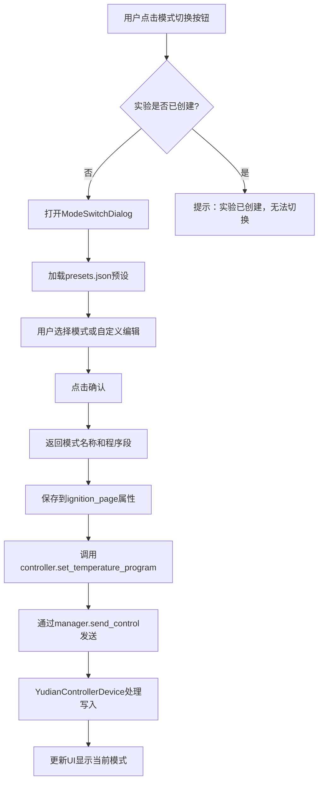

# 实验模式切换功能实现计划

## 概述

在着火点检测实验页面添加模式切换按钮和对话框，用户可以选择预设的实验模式（标准模式/教学模式）或自定义编辑温控曲线参数。模式只能在实验创建前切换，实验创建后按钮禁用。

## 实现步骤

### 1. 扩展YudianControllerDevice类

**修改文件**: [`src/modbus_multi_device/modbus_multi_device/devices.py`](src/modbus_multi_device/modbus_multi_device/devices.py)

在`YudianControllerDevice.write_control()`方法中添加对`set_program_segments`的支持：

```python
if 'set_program_segments' in control_data:
    segments = control_data['set_program_segments']['segments']
    # 1. 设置程序段数(Pno)到地址0x2B
    seg_count = len(segments)
    self.client.write_register(address=0x2B, value=seg_count, device_id=self.address)
    time.sleep(0.1)
    
    # 2. 写入每个程序段的温度和时间到0x50开始的地址
    for i, (sp, t) in enumerate(segments):
        sp_value = int(self._convert_value(sp, is_write=True))
        if sp_value < 0:
            sp_value = 65536 + sp_value
        
        sp_addr = 0x50 + i * 2
        t_addr = sp_addr + 1
        
        # 写入温度和时间
        self.client.write_register(sp_addr, sp_value, device_id=self.address)
        t_value = int(t) if t >= 0 else 65536 + int(t)
        self.client.write_register(t_addr, t_value, device_id=self.address)
        time.sleep(0.05)
```

### 2. 创建模式切换对话框

**新建文件**: [`src/views/dialogs/mode_switch_dialog.py`](src/views/dialogs/mode_switch_dialog.py)

对话框包含以下功能：

- **预设模式选择区域**：显示标准实验模式和教学实验模式的单选按钮，从`configs/presets.json`加载
- **模式描述显示**：当选择预设模式时，显示该模式的描述信息
- **温控曲线参数表格**：可视化显示和编辑程序段列表（温度、时间）
  - 表格列：程序段号、目标温度(℃)、时间(分钟)
  - 支持添加、删除、编辑程序段
- **自定义模式选项**：提供"自定义模式"单选项，允许完全自定义参数
- **确认/取消按钮**

数据流：

- 从`configs/presets.json`加载预设模式（标准实验模式、教学实验模式）
- 用户选择预设或自定义编辑温控曲线
- 通过Signal返回选择的温控曲线参数：`confirmed(str, list)` - (模式名称, 程序段列表)

**注意**：程序段格式为`[[温度, 时间], [温度, 时间], ...]`，负时间值表示特殊控制（如-121表示停止运行）

### 3. 修改着火点实验页面UI

**修改文件**: [`src/views/pages/ignition_page.py`](src/views/pages/ignition_page.py)

#### 3.1 在`_create_controller_panel()`方法中添加模式显示和切换按钮

在温控仪表面板中添加：

- **当前模式标签**（位置：PV/SV/MV参数显示区域之前）
  ```python
  self.lbl_current_mode = QLabel("当前模式: 未设置")
  self.lbl_current_mode.setStyleSheet("font-size: 10pt; color: #999999;")
  ```

- **模式切换按钮**（位置：在"运行"和"停止"按钮的上方，单独一行）
  ```python
  self.btn_mode_switch = QPushButton("模式切换")
  self.btn_mode_switch.setObjectName("standardButton")
  self.btn_mode_switch.clicked.connect(self._on_mode_switch)
  ```


#### 3.2 添加模式管理属性

在`__init__`方法中初始化：

```python
self.current_mode_name = None  # 当前模式名称
self.current_mode_segments = None  # 当前模式的程序段列表
```

#### 3.3 实现模式切换逻辑

新增方法：

- `_on_mode_switch()`: 打开模式切换对话框
- `_on_mode_confirmed(mode_name, segments)`: 处理模式确认，保存模式并更新UI显示
- `_apply_mode_to_controller(segments)`: 将温控曲线应用到温控器（通过controller和manager发送控制命令）

#### 3.4 更新按钮状态管理

修改`_update_button_states()`方法：

- 当`current_session_id`不为None时（实验已创建），禁用模式切换按钮
- 当`current_session_id`为None时（未创建实验），启用模式切换按钮（前提是设备已连接）

### 4. 在ignition_controller中添加设置程序段方法

**修改文件**: [`src/controllers/ignition_controller.py`](src/controllers/ignition_controller.py)

添加新方法`set_temperature_program()`，通过manager发送控制命令：

```python
def set_temperature_program(self, segments: list) -> bool:
    """
    设置温控曲线程序段
    
    Args:
        segments: 程序段列表 [[温度, 时间], ...]
    
    Returns:
        bool: 设置是否成功
    """
    if not self.manager or not self.manager.started:
        self.log_message.emit("✗ 设备管理器未启动")
        return False
    
    try:
        self.manager.send_control(
            device_name='着火点-温控仪表',
            control_data={
                'set_program_segments': {
                    'segments': segments
                }
            },
            priority='high'
        )
        self.log_message.emit(f"温控曲线已设置 ({len(segments)}个程序段)")
        self.logger.info(f"设置温控曲线: {segments}")
        return True
    except Exception as e:
        self.log_message.emit(f"✗ 设置失败: {e}")
        self.logger.error(f"设置温控曲线失败: {e}")
        return False
```

### 5. 更新对话框模块导出

**修改文件**: [`src/views/dialogs/__init__.py`](src/views/dialogs/__init__.py)

添加新对话框的导入和导出：

```python
from .mode_switch_dialog import ModeSwitchDialog

__all__ = [
    ...
    'ModeSwitchDialog',
]
```

## 数据流程图



## 关键技术点

1. **预设配置加载**: 从`configs/presets.json`读取预设模式
2. **温控曲线验证**: 确保程序段参数有效（温度范围、时间范围）
3. **线程安全**: 温控器通讯在后台线程，使用Signal/Slot机制
4. **状态管理**: 根据实验状态动态启用/禁用模式切换按钮
5. **UI响应**: 实时预览选择的温控曲线参数

## 文件清单

- 修改: `src/modbus_multi_device/modbus_multi_device/devices.py` (YudianControllerDevice类，添加约30行)
- 新建: `src/views/dialogs/mode_switch_dialog.py` (约300-400行)
- 修改: `src/views/pages/ignition_page.py` (添加约80-100行)
- 修改: `src/controllers/ignition_controller.py` (添加约25行)
- 修改: `src/views/dialogs/__init__.py` (添加2行)
- 引用: `configs/presets.json` (已存在，读取预设配置)