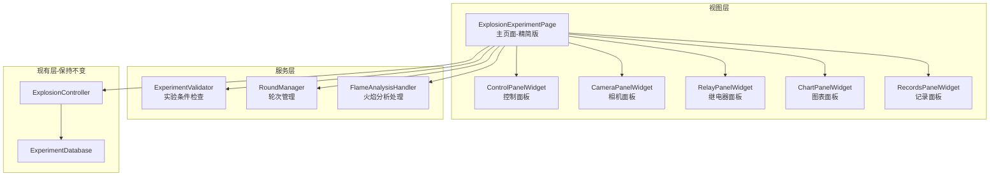

# 爆炸实验页面中度重构计划

## 重构目标

1. **提高可测试性**：将业务逻辑从UI层分离，使其可以独立测试
2. **提高可复用性**：UI组件独立化，可在其他页面复用
3. **提高可维护性**：减少单文件代码量，职责更清晰
4. **保持兼容性**：不改变对外接口，不影响现有功能

## 当前架构问题

[explosion_page.py](src/views/pages/explosion_page.py) 存在以下问题：

- 2005行代码全在一个类中
- UI创建、事件处理、业务逻辑混合
- 方法过长（如`_on_flame_analysis_complete`超过150行）
- 难以测试和维护

## 重构架构设计



## 实施步骤

### 第一阶段：提取业务逻辑服务（优先）

创建 `src/services/explosion/` 目录结构：

#### 1. 实验条件验证器 `experiment_validator.py`

提取 `_check_experiment_conditions` 方法（100+行）为独立服务：

```python
class ExperimentValidator:
    def __init__(self, config, manager):
        self.config = config
        self.manager = manager
    
    def check_conditions(self) -> tuple[bool, str]:
        """检查实验条件，返回(是否满足, 详细信息)"""
        # 温度检查
        # 压力检查
        # 返回结果和详细消息
```

**好处**：可以独立单元测试，不依赖UI

#### 2. 轮次管理器 `round_manager.py`

提取轮次判断和流程控制逻辑：

```python
class RoundManager:
    def __init__(self, config):
        self.max_rounds = config.get('test-rounds', {}).get('max-rounds', 10)
        self.phase_rounds = config.get('test-rounds', {}).get('phase-rounds', 5)
        self.thresholds = config.get('explosion-thresholds', {})
    
    def should_continue_phase2(self, round_records: list) -> tuple[bool, str]:
        """判断是否需要进入第二阶段"""
    
    def evaluate_explosion_level(self, avg_flame_length: float) -> tuple[str, str]:
        """评估爆炸性等级"""
    
    def get_next_action(self, current_round: int, round_records: list) -> dict:
        """获取下一步操作（继续/完成/第二阶段）"""
```

**好处**：业务规则集中管理，易于修改和测试

#### 3. 火焰分析处理器 `flame_analysis_handler.py`

提取 `_on_flame_analysis_complete` 的核心逻辑（150+行）：

```python
class FlameAnalysisHandler:
    def __init__(self, round_manager, database):
        self.round_manager = round_manager
        self.database = database
    
    def process_analysis_results(self, results: dict, session_id: int, 
                                  round_number: int) -> dict:
        """
        处理火焰分析结果，返回下一步操作
        返回: {
            'action': 'continue' | 'phase2' | 'complete',
            'message': str,
            'data': dict
        }
        """
```

**好处**：复杂业务逻辑独立，便于测试和调试

### 第二阶段：提取UI组件

创建 `src/views/widgets/explosion/` 目录结构：

#### 4. 控制面板组件 `control_panel.py`

提取 `_create_control_panel` 及相关逻辑：

```python
class ControlPanelWidget(QGroupBox):
    # 信号定义
    connect_clicked = Signal()
    new_experiment_clicked = Signal()
    start_clicked = Signal()
    stop_clicked = Signal()
    
    def __init__(self, config, parent=None):
        super().__init__("实验控制", parent)
        self._init_ui()
    
    def update_button_states(self, state):
        """根据状态更新按钮"""
    
    def update_status_display(self, text, color):
        """更新状态显示"""
```

#### 5. 相机面板组件 `camera_panel.py`

提取 `_create_camera_panel` 及相关逻辑

#### 6. 继电器面板组件 `relay_panel.py`

提取 `_create_relay_panel` 及相关逻辑

#### 7. 图表面板组件 `chart_panel.py`

提取 `_create_chart_panel` 及相关逻辑

#### 8. 记录面板组件 `records_panel.py`

提取 `_create_records_panel` 及相关逻辑

### 第三阶段：重构主页面

#### 9. 精简 ExplosionExperimentPage

- 使用组件组装UI（代码量减少60%）
- 事件处理简化为转发
- 业务逻辑调用服务层
- 保持对外信号和接口不变

**重构前后对比**：

```python
# 重构前（100+行）
def _check_experiment_conditions(self):
    # 大量业务逻辑...
    
# 重构后（10行）
def _check_experiment_conditions(self):
    is_valid, message = self.validator.check_conditions()
    if not is_valid:
        QMessageBox.warning(self, "实验条件不满足", message)
        self.log_message.emit("✗ 实验条件检查失败")
    return is_valid
```

## 文件结构

新增文件：

```
src/
├── services/
│   └── explosion/
│       ├── __init__.py
│       ├── experiment_validator.py     (约100行)
│       ├── round_manager.py            (约150行)
│       └── flame_analysis_handler.py   (约200行)
├── views/
│   └── widgets/
│       └── explosion/
│           ├── __init__.py
│           ├── control_panel.py        (约150行)
│           ├── camera_panel.py         (约100行)
│           ├── relay_panel.py          (约120行)
│           ├── chart_panel.py          (约100行)
│           └── records_panel.py        (约150行)
```

修改文件：

- [explosion_page.py](src/views/pages/explosion_page.py)：从2005行减少到约800行

## 兼容性保证

1. **对外接口不变**：保持所有公共方法和信号
2. **功能不变**：所有现有功能正常工作
3. **配置兼容**：继续使用现有配置结构
4. **Controller集成**：保持与ExplosionController的交互方式

## 测试策略

重构后可以轻松编写单元测试：

```python
# 测试实验条件验证器
def test_experiment_validator():
    validator = ExperimentValidator(config, mock_manager)
    is_valid, msg = validator.check_conditions()
    assert is_valid == True

# 测试轮次管理器
def test_round_manager_phase2():
    manager = RoundManager(config)
    should_continue, msg = manager.should_continue_phase2(records)
    assert should_continue == True
```

## 预期收益

1. **代码量**: 主文件从2005行降至800行（减少60%）
2. **可测试性**: 业务逻辑可独立单元测试
3. **可维护性**: 职责清晰，易于定位问题
4. **可复用性**: UI组件可在其他页面使用
5. **扩展性**: 新增功能时影响范围小

## 注意事项

1. 重构过程中保持小步提交，确保每步可运行
2. 优先重构业务逻辑（服务层），降低风险
3. UI组件提取时保持信号机制不变
4. 充分测试每个重构步骤