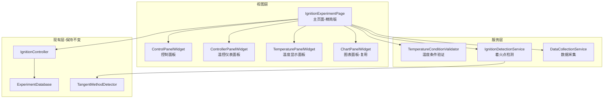

# 着火点实验页面中度重构计划

## 重构目标

1. **提高可测试性**：将业务逻辑从UI层分离，使其可以独立测试
2. **提高可复用性**：UI组件独立化，可在其他页面复用
3. **提高可维护性**：减少单文件代码量，职责更清晰
4. **保持兼容性**：不改变对外接口，不影响现有功能

## 当前架构问题

[ignition_page.py](src/views/pages/ignition_page.py) 存在以下问题：

- 1105行代码全在一个类中
- UI创建、事件处理、业务逻辑混合
- 着火点检测逻辑复杂（_check_ignition约60行）
- 温度条件检查方法较长（_check_temperature_condition约50行）
- 难以测试和维护

## 重构架构设计



## 实施步骤

### 第一阶段：提取业务逻辑服务

创建 `src/services/ignition/` 目录结构：

#### 1. 温度条件验证器 `temperature_condition_validator.py`

提取 `_check_temperature_condition` 方法（约50行）为独立服务：

```python
class TemperatureConditionValidator:
    def __init__(self, config, manager):
        self.config = config
        self.manager = manager
    
    def check_start_condition(self) -> tuple[bool, str]:
        """检查启动条件，返回(是否满足, 详细信息)"""
        # 检查温度是否小于collect_start_temperature
```

#### 2. 着火点检测服务 `ignition_detection_service.py`

提取 `_check_ignition` 和 `_mark_ignition` 方法（约80行）为独立服务：

```python
class IgnitionDetectionService:
    def __init__(self, config, tangent_detector):
        self.config = config
        self.tangent_detector = tangent_detector
    
    def check_ignition(self, temp_history: dict, ignition_flags: list) -> list:
        """检测着火点，返回检测结果列表"""
    
    def mark_ignition(self, channel: int, temperature: float, method: str) -> dict:
        """标记着火点，返回标记信息"""
```

#### 3. 数据采集服务 `data_collection_service.py`

提取数据采集逻辑：

```python
class DataCollectionService:
    def __init__(self, config, controller):
        self.config = config
        self.controller = controller
    
    def should_collect(self, current_temp: float, is_running: bool) -> bool:
        """判断是否应该采集数据"""
```

### 第二阶段：提取UI组件

创建 `src/views/widgets/ignition/` 目录结构：

#### 4. 控制面板组件 `control_panel.py`

提取 `_create_control_panel` 及相关逻辑：

```python
class ControlPanelWidget(QGroupBox):
    # 信号定义
    connect_clicked = Signal()
    new_experiment_clicked = Signal()
    start_stop_clicked = Signal()
    finalize_clicked = Signal()
    
    def update_button_states(self, state):
        """根据状态更新按钮"""
```

#### 5. 温控仪表面板组件 `controller_panel.py`

提取 `_create_controller_panel` 及相关逻辑

#### 6. 温度显示面板组件 `temperature_panel.py`

提取 `_create_temperature_panel` 及相关逻辑

#### 7. 图表面板组件（复用）

可以复用 `explosion` 中的 `ChartPanelWidget`，或创建通用版本

### 第三阶段：重构主页面

#### 8. 精简 IgnitionExperimentPage

- 使用组件组装UI（代码量减少50%）
- 事件处理简化为转发
- 业务逻辑调用服务层
- 保持对外信号和接口不变

**重构前后对比**：

```python
# 重构前（50+行）
def _check_temperature_condition(self):
    # 大量业务逻辑...
    
# 重构后（10行）
def _check_temperature_condition(self):
    is_valid, message = self.temp_validator.check_start_condition()
    if not is_valid:
        QMessageBox.warning(self, "实验条件不满足", message)
        self._thread_safe_log("✗ 启动实验失败")
    return is_valid
```

## 文件结构

新增文件：

```
src/
├── services/
│   └── ignition/
│       ├── __init__.py
│       ├── temperature_condition_validator.py  (约60行)
│       ├── ignition_detection_service.py       (约120行)
│       └── data_collection_service.py          (约50行)
├── views/
│   └── widgets/
│       └── ignition/
│           ├── __init__.py
│           ├── control_panel.py                (约130行)
│           ├── controller_panel.py             (约100行)
│           ├── temperature_panel.py            (约80行)
```

修改文件：

- [ignition_page.py](src/views/pages/ignition_page.py)：从1105行减少到约600行

## 兼容性保证

1. **对外接口不变**：保持所有公共方法和信号
2. **功能不变**：所有现有功能正常工作
3. **配置兼容**：继续使用现有配置结构
4. **Controller集成**：保持与IgnitionController的交互方式

## 预期收益

1. **代码量**: 主文件从1105行降至600行（减少45%）
2. **可测试性**: 业务逻辑可独立单元测试
3. **可维护性**: 职责清晰，易于定位问题
4. **可复用性**: UI组件可在其他页面使用
5. **扩展性**: 新增检测算法时影响范围小

## 注意事项

1. 保持着火点检测的准确性
2. 确保切线法检测器的集成正确
3. 保持数据采集的实时性
4. 充分测试所有检测算法